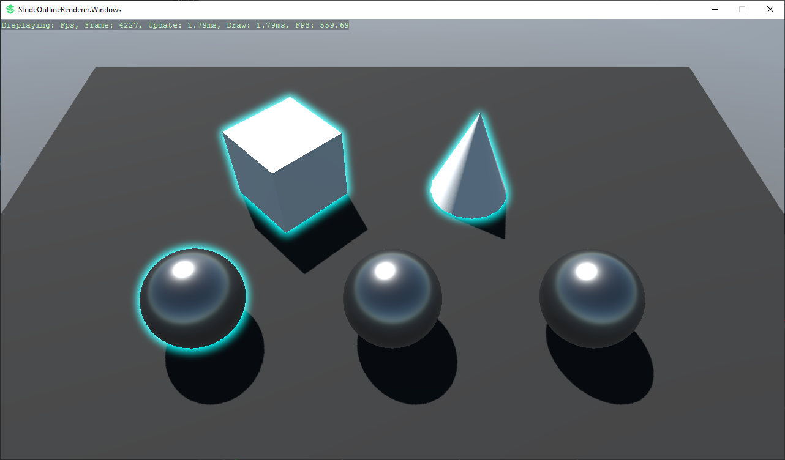
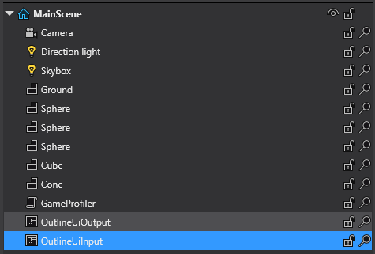
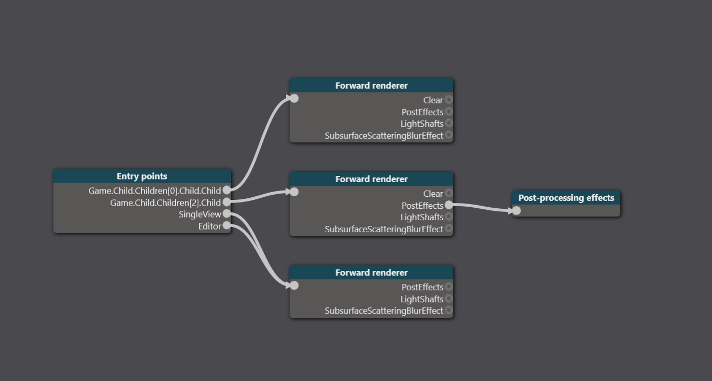
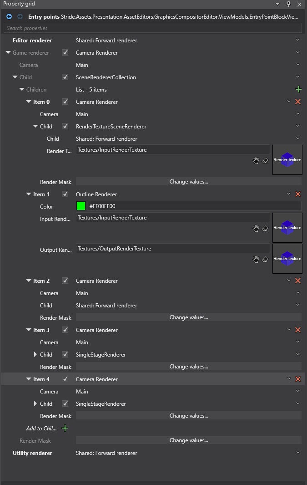
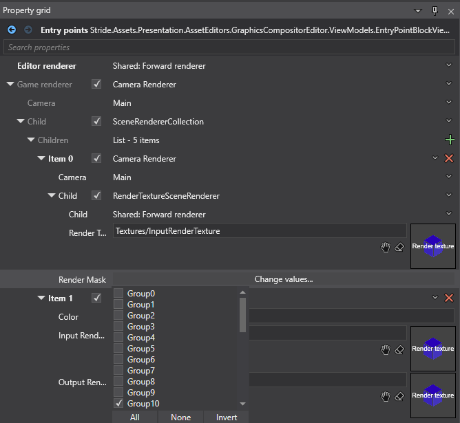
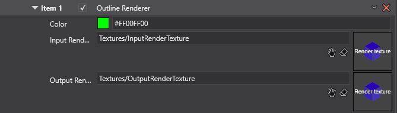
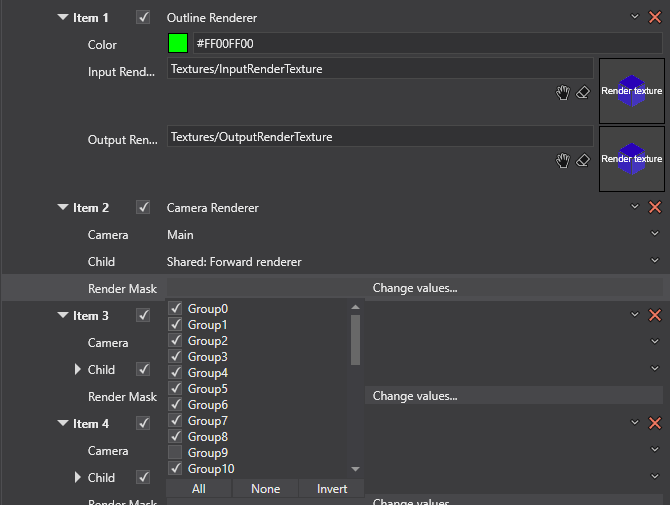
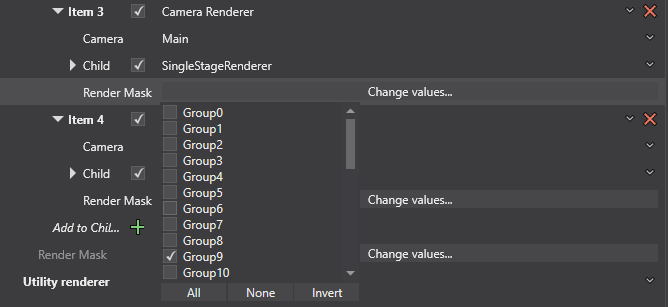
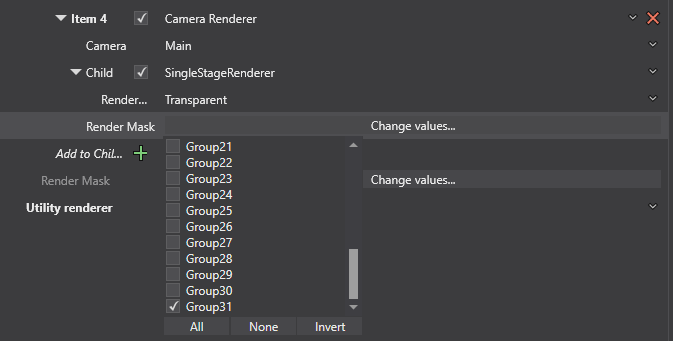

# StrideOutlineRenderer
Stride Outline Renderer - Renderer for Rendering 3D Object (Model Component) Outlines

 

## Features:
- Halo/Bloom/Blend outline effect for model components (this is not a shader)
- Enable outline on model components by assigning render group at runtime
- Disable outline on model components by assigning render group at runtime
- Permanently enable outline on model components by assigning render group on Outline Component and enable "AlwaysOutlined"
- Performance should scale (horizontally) directly with PostFX Bloom process

## How it works:
- Uses physics ray casting in player controller to activate outline on objects, requires colliders
- Model components are set to RenderGroup9, when they are highlighted they are changed to RenderGroup10 (arbitrary assignments)
- Model components have an OutlineComponent attached to them, assigning a highlight color and outline RenderGroup (RenderGroup10)
- RenderTextureSceneRenderer in Compositor writes only RenderGroup10 to a render texture (InputRenderTexture)
- OutlineRenderer uses SpriteBatch to write a new RenderTexture (OutputRenderTexture) by saturating color
- OutlineUiOutput Entity/UiComponent in Scene renders the OutputRenderTexture to the camera as RenderGroup30
- RenderGroup30 has PostFX applied through SharedRenderer (This is how the bloom occurs)
- InputRenderTexture is excluded from PostFX, but added as a SingleStageRenderer for Transparent pass "on top of" bloom effect

Scene:

Compositor:

 
 
Compositor Expanded:

  
Compositor Render Texture (Item 0):

Compositor Outline Renderer (Item 1):

Compositor Shared Renderer to Post FX Omit Group 9 (Item 2):

Compositor Group 9 Single Stag Renderer:

Compositor Group 9 Single Stag Renderer:

Compositor Group 31 Single Stage Renderer:

 
## Potential Improvements
- You could combine the RenderTextureSceneRenderer functionality into the OutlineRenderer

## Other Implementations
- Check my GitHub profile, I will also release the non-bloom version with a combined Renderer (RenderTexture and SpriteBatcher).

